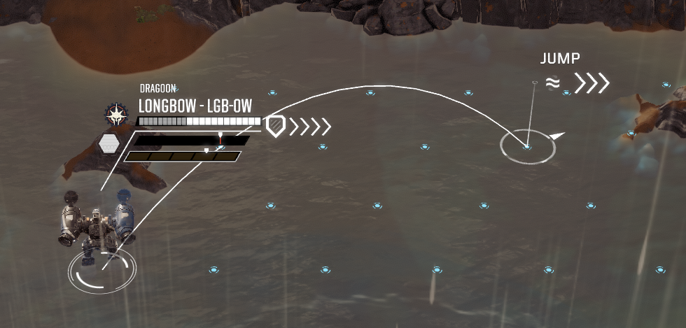

# Jump Jets for All

Allows mounting of jump jets to any mech that does not have any jump jets.  Defaults to four.

People asked for this mod, so have fun.

# Compatibility
{todo:  test what happens when removing the mod from a save.  I would expect something to break.}

# Settings 
|Setting| Description|
|--|--|
|JumpJetCount|The number of jump jets to allow on the mechs.  Defaults to 4|
