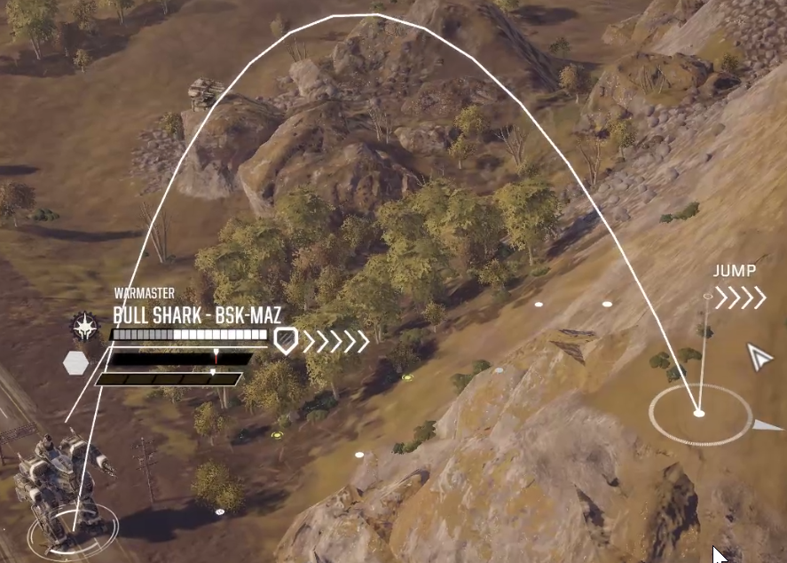
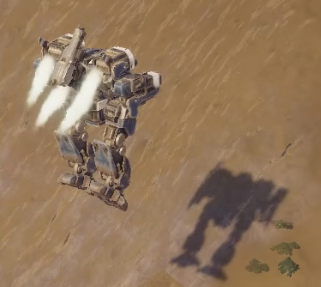

# Jump Jets for All

Allows all mechs to mount jump jets.

People asked for this mod, so have fun jumping a Bull Shark around the map.

# Compatibility 

Should be safe to add and remove from existing saves.

If the mod is disabled or removed, modified mechs will retain any mounted jump jets until they are removed.

# Settings 
|Setting| Description|
|--|--|
|JumpJetCount|The number of jump jets to allow on the mechs.  Defaults to 4|
|IncludeMechsWithJumpJets| If false, does not include mechs which already support jump jets.  Defaults to false|
